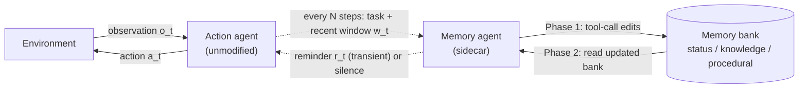

# Part 01 — The Idea

> **Read this when:** you want the whole paper in ten minutes — what it is, who it is for, what problem it solves, and why it works.
>
> **TL;DR:** Long-horizon agents forget to *act on* what they already know. A sidecar "memory agent" maintains a small structured memory bank and, at each memory step, decides either to inject one short memory-grounded reminder into the action agent's next call, or to stay silent. Selective, well-timed intervention beats passive memory — and it is plug-and-play with unmodified frontier agents.

## 1. What the paper is

| Field | Value |
|---|---|
| Title | *Remember When It Matters: Proactive Memory Agent for Long-Horizon Agents* |
| Authors | Yifan Wu, Lizhu Zhang, Yuhang Zhou, Mingyi Wang, Bo Peng, Serena Li, Xiangjun Fan, Zhuokai Zhao |
| Affiliation | Meta AI |
| Published | July 10, 2026 · arXiv:2607.08716v1 [cs.AI] |
| Authors' code | <https://github.com/yifannnwu/proactive-memory-agent> — linked in the paper; not yet vetted by us |
| Benchmarks | Terminal-Bench 2.0 (autonomous command-line agents) · τ²-Bench (airline / retail / telecom conversational tool use) |
| Kind | Systems + empirical paper, with a preliminary training study |

Three contributions, in the authors' own structure:

1. **Names a failure mode** — *behavioral state decay* — as a central cause of long-horizon agent failures.
2. **Proposes an architecture** — a two-phase memory agent, decoupled from the action agent, that maintains execution state and *selectively intervenes*. Validated on two benchmarks plus ablations against passive-memory and advisor-style baselines.
3. **Shows the policy is learnable** — SFT + GRPO on Qwen3.5-27B partially reproduces the prompted frontier memory agent and transfers +3.5 pp to held-out Terminal-Bench.

## 2. The core problem: behavioral state decay

> "During long-horizon execution, information that should shape future actions — task requirements, environment facts, previous attempts, failure diagnoses, intermediate discoveries, and open subgoals — stops influencing the agent's next decision."

The crucial subtlety: the information **may still be inside the context window**. Presence ≠ influence (cf. "lost in the middle", Liu et al. 2024). So this is not primarily a storage problem, and bigger context windows or better retrieval do not fix it.

Signature failures the paper opens with:

- The agent identifies a requirement early, then **violates it** while fixing an unrelated bug.
- The agent observes that a command / parameter / implementation path fails, then later **retries a near-identical variant**.
- The agent diagnoses an error pattern, then later **treats the same pattern as new**.

The information that must stay "behaviorally alive" is called **execution state**: task requirements, environment facts, previous attempts, failure diagnoses, intermediate discoveries, open subgoals.

The reframe: existing memory systems optimize *what to store and how to retrieve*. Long-horizon execution additionally requires deciding **when remembered state should re-enter the control loop** — memory as an *intervention* problem. It is a stronger question than summarization: "a summarizer asks what to retain; our memory asks whether any retained execution state should become active in the action agent's next decision" (§1–2).

## 3. The solution in one diagram

The loop:

1. The **action agent** (any frontier model + tool-use scaffold, completely unmodified) interacts with the environment as usual.
2. A **memory agent** is invoked at the first step and then every N steps. It sees the task description, a sliding window of the last k messages, and the current memory bank.
3. **Phase 1 — memory management:** it edits a structured bank (status / knowledge / procedural) through four constrained tool calls.
4. **Phase 2 — intervention:** it emits either `<context_for_action>` (one concise, memory-grounded reminder, injected into the next action-agent call as *transient* context) or `<no_intervention/>` (explicit silence).

## 4. The five design bets

1. **Memory is a policy over interventions, not a store.** The output that matters is "speak or stay silent," decided at every memory step.
2. **Silence is an explicit action.** Ablations show that removing the silence option costs domain-balanced (macro) performance — unnecessary interventions "can be harmful rather than merely redundant."
3. **Separate memory agent; untouched action agent.** Plug-and-play with existing harnesses; no fine-tuning, prompt surgery, or scaffold changes on the actor.
4. **Structured bank with constrained edits.** Phase 1 emits tool calls (save / update-status / delete-by-id) — never free-form summaries — keeping state compact and updatable over long runs.
5. **Reminders are memory-grounded and transient.** No broad strategy advice (that is what advisor models do); injected only into the next call, so the actor's context is never permanently polluted.

## 5. Who it is for

- **Builders of long-horizon agents** — coding/terminal agents, customer-support tool agents, ML-engineering agents — who see requirement violations, repeated failed attempts, or forgotten diagnoses in long traces.
- **Agent-harness authors.** The module needs only (a) read access to the recent message window and (b) the ability to attach one transient context block to the next model call.
- **Researchers in agent memory / context management.** It isolates a new control question — *when should memory intervene?* — and provides an RL recipe for training it.
- **Cost-sensitive deployments** (eventually): the trained 27B memory agent points toward replacing the frontier sidecar with a cheap open-weight one.

It works today **by prompting alone** — no training required. The training track is optional and explicitly preliminary.

## 6. Headline results

Memory agent = Claude Opus 4.6. Scores are pass@1 (Table 1):

| Benchmark | Action agent | Baseline | + Memory | Δ |
|---|---|---|---|---|
| Terminal-Bench 2.0 (85 tasks) | Sonnet 4.5 | 37.6% | 45.9% | **+8.3 pp** |
| Terminal-Bench 2.0 (85 tasks) | Opus 4.6 | 43.5% | 45.9% | **+2.4 pp** |
| τ²-Bench (278 tasks, task-weighted avg) | Sonnet 4.5 | 55.0% | 61.8% | **+6.8 pp** |
| τ²-Bench (278 tasks, task-weighted avg) | Opus 4.6 | 66.2% | 68.7% | **+2.5 pp** |

Three takeaways:

- **Helps weak and strong actors.** Gains shrink but do not vanish for Opus — so the memory agent is not merely compensating for a weak model. Notably, Sonnet-with-memory matches the Opus baseline on Terminal-Bench.
- **Selectivity is the active ingredient.** Ablations (part 06): exposing the full bank every step, forcing injection every step, advisor-style guidance without a bank, and Mem0-style retrieval all trail the full system on macro average.
- **The policy is learnable — and calibration is the hard part.** An *untrained* 27B memory agent makes the agent worse; SFT recovers the loss, GRPO improves further and transfers to a held-out benchmark (part 07).

## 7. Vocabulary used throughout this repo

| Term | Meaning |
|---|---|
| Behavioral state decay | Execution state stops influencing decisions, even if still present in context |
| Execution state | Requirements, environment facts, attempts, diagnoses, discoveries, open subgoals |
| Memory bank `B = (s, K, P)` | status (private) + knowledge entries + procedural entries |
| Phase 1 / Phase 2 | Bank management via tool calls / intervention selection |
| Intervention `i_t` | Either a text reminder `r_t` or the explicit null action `∅` |
| Transient injection | Reminder appears only in the *next* action-agent call, then disappears |
| Trigger `g(t)` | Schedule deciding when the memory agent runs (paper: first step + fixed interval) |
| Pivot turns | Memory steps most likely to affect task success; used to focus RL updates |

---

**Next:** [part 02 — the problem & positioning](part_02_behavioral_state_decay.md) · [part 03 — architecture](part_03_architecture_and_control_loop.md)
