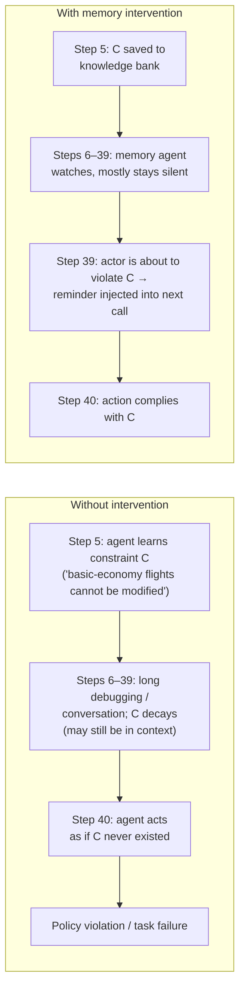

# Part 02 — Behavioral State Decay: the Problem & Positioning

> **Read this when:** you want to understand precisely which failure this system fixes, why longer contexts / RAG / summarizers / advisors do not fix it, and where the paper sits relative to adjacent work.
>
> **TL;DR:** The bottleneck is *control*, not *capacity*: state the agent already produced stops steering its later actions. Adjacent research lines optimize storage, retrieval, compression, or advice — none of them decides **whether and when remembered state should interrupt the next decision**. That decision is the paper's entire contribution.

## 1. Definition (§1)

> "We call this failure mode **behavioral state decay**: during long-horizon execution, information that should shape future actions like task requirements, environment facts, previous attempts, failure diagnoses, intermediate discoveries, and open subgoals stops influencing the agent's next decision. The information may still be present in the transcript, or may even remain within the model's context window, but it no longer exerts reliable control over behavior."

Two properties make this failure mode distinctive:

1. **It is about influence, not availability.** The fact can be fully retrievable — even literally in context — and still be behaviorally inert.
2. **It is about the *next* decision.** The unit of failure is a single action taken as if a known constraint / result / diagnosis did not exist.

## 2. Why "just give it more context" fails

- **Position effects.** Models under-utilize information depending on where it sits in the context ("lost in the middle", Liu et al. 2024) — the paper's formalism explicitly allows that what the scaffold exposes to the action policy "may be truncated, summarized, or otherwise filtered" (§3.1).
- **Attention is consumed by the local problem.** Qualitative traces (§4.4) show actors deep in a debugging loop accumulating observations and then acting against them.
- **Surfacing everything is not free.** "Surfacing too little memory lets the agent repeat mistakes or ignore prior discoveries; surfacing too much adds latency, consumes tokens, and can distract the agent from local progress" (§1).

## 3. What actually decays: the execution-state taxonomy

| Execution state | Examples from the paper |
|---|---|
| Task requirements | regex boundary condition in `regex-log`; "basic economy cannot be modified" (τ² airline) |
| Environment facts | Git server setup; ARS file-write failure; paths, tool limitations, system quirks |
| Previous attempts | repeated failed file edits in `adaptive-rejection-sampler`; telecom diagnostic retries |
| Failure diagnoses | regex misses single-digit IPv4 octets; SQLite gcov configuration |
| Intermediate discoveries | tool output shows user is a Regular member, not Gold as claimed |
| Open subgoals | which user / order / line / branch / subgoal is currently active |

## 4. Intervention is a stronger question than summarization (§1, §2.5)

> "This is a stronger control question than summarization. A summarizer asks what to retain; our memory asks whether any retained execution state should become active in the action agent's next decision."

Because tasks differ in failure modes — sometimes the decisive memory is a hard requirement from the instruction, sometimes an environment fact, a failed command, a bug diagnosis, or an unfinished subgoal — "a fixed summarization policy cannot know whether a memory should interrupt the next action." What is needed is **intervention calibration**: whether, when, and how remembered state enters the actor's context "so that it changes the next decision without unnecessary token or latency overhead."

## 5. Positioning against the four adjacent research lines (§2)

| Line of work | Representatives | What it optimizes | The gap this paper targets |
|---|---|---|---|
| Memory storage & retrieval | RAG / REALM (Lewis, Guu 2020), MemGPT (Packer 2023), MemoryBank (Zhong 2024), Generative Agents (Park 2023), Voyager skills (Wang 2024), Mem0 (2026) | Persisting and finding records; personalization; cross-session recall | Complementary — none decides *when* a memory should interrupt the live control loop |
| Learned memory / context policies | Memory-as-Action (Zhang 2025), Context-Folding (Sun 2025), Mem-α (Wang 2025) | The action agent curates its *own* context; or memory optimized for later QA accuracy | Here a **separate** agent watches a live trajectory and intervenes; credit assignment is more heterogeneous — sometimes silence is correct, and bad interventions actively harm (not just waste tokens) |
| Reflection & search | Self-Refine (Madaan 2023), Reflexion (Shinn 2023), Tree of Thoughts (Yao 2023a) | Self-feedback across attempts; deliberate search over thoughts | Orthogonal — Reflexion's memory works *across* episodes; this paper manages within-run state and its timing |
| Advisor models | Asawa et al. 2025; Anthropic Advisor tool (2026) | A second model steers a black-box executor with broad natural-language guidance | Closest cousins — but the memory agent is deliberately **constrained to memory-grounded reminders** (requirement, fact, attempt, diagnosis, subgoal at risk of going inactive), not strategy. The "injection-only (no bank)" ablation ≈ advisor-style, and it is unstable (hurts airline; part 06 §4) |

## 6. The one-sentence positioning (§2.5)

> "The central question is not only what should be remembered or summarized, but whether, when, and how remembered execution state should enter the action agent's context so that it changes the next decision without unnecessary token or latency overhead."

---

**Next:** [part 03 — architecture & control loop](part_03_architecture_and_control_loop.md)
