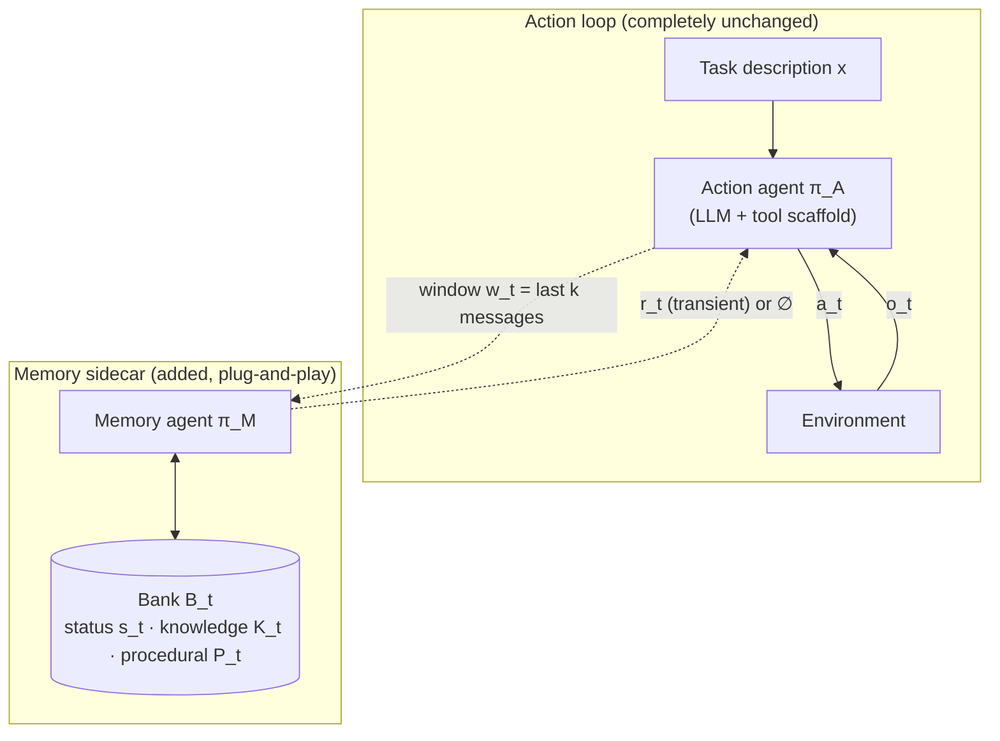
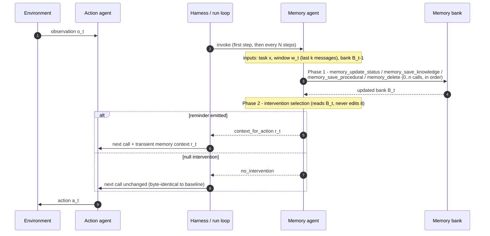

# Part 03 — Architecture & Control Loop

> **Read this when:** you are implementing the system skeleton — who calls whom, with which inputs, on what schedule, and what exactly gets injected.
>
> **TL;DR:** An unmodified action agent runs its normal loop. A memory agent is invoked at step 1 and then every N steps with (task, last-k-message window, current bank). It first edits the bank via tool calls (Phase 1), then either emits one reminder — injected into the *next* action call only — or explicit silence (Phase 2).

## 1. Formal setup (§3.1)

- Trajectory `τ = (o₁, a₁, o₂, a₂, …, o_T)`; task description `x`; the action agent samples `a_t ∼ π_A(a_t | x, τ_<t)` — an LLM plus tool-use scaffold.
- Built into the formalism: the scaffold may **truncate, summarize, or filter** what `π_A` actually sees at each step. The memory system therefore cannot assume the actor still "has" anything.
- The memory agent `π_M` observes: task `x`, a recent trajectory window `w_t = W_k(τ_<t, o_t)`, and the current bank `B_{t−1}`. It acts in two stages:
  - **Bank edit:** `B_t ∼ π_M^edit(· | x, w_t, B_{t−1})`
  - **Intervention:** `i_t ∼ π_M^intervene(· | x, w_t, B_t)`, with `i_t ∈ {∅, text reminder}`
- If `i_t` is a reminder `r_t`, it is supplied to the **next** action-agent call as separate *transient memory context*. If `i_t = ∅`, the action agent proceeds with a context identical to baseline.

> "This formulation treats memory as a policy over interventions. The memory agent must decide not only what execution state to retain, but also when remembered state is useful enough to enter the action loop." (§3.1)

## 2. System integration (Figure 1a)

Key properties:

- **The action agent is untouched.** "The action agent's base instructions, tools, and decoding procedure are unchanged; the only change is the optional memory context provided at call time" (§3.3).
- **Sidecar framing.** The memory agent "runs as a separate process beside an unmodified action agent" (Fig. 1 caption), but its Phase-2 output gates the *next* call — so in practice each memory step sits between action steps. **Paper gap:** synchronous vs. asynchronous execution (and its latency cost) is not specified — see part 08.
- **Minimal harness contract.** Plug-and-play requires only: (a) read access to the recent message window, (b) one injectable transient context slot on the next model call.

## 3. One memory step, end to end (Figure 1b)

## 4. Triggering `g(t)` (§3.4)

- Main implementation: invoke at the **first step**, then at a **fixed interval**.
- In the paper's experiments the interval is **every step**, with window **k = 8 messages** (§4.1).
- This is a deliberate simplification: a fixed schedule "isolates the effect of the memory intervention policy itself."
- Named-but-unused alternatives: trigger only after tool errors, failed tests, repeated commands, or large context shifts. Learning *when to invoke* is listed as an open direction (§5).

## 5. Injection semantics — the part that is easy to get wrong (§3.3)

1. **Transient.** The reminder is attached to the *next* call only; it does not become part of the persistent conversation history. This prevents cumulative context pollution.
2. **Separate context.** It is supplied as a distinct "transient memory context" — not an edit to the system prompt, not a rewrite of history.
3. **At most one reminder per memory step**, concise and targeted. Phase 2 never modifies the bank.
4. **Silence leaves the call unchanged.** The null intervention `∅` is an explicit, first-class action — not a degenerate case.
5. **The status field is never injected.** It is the memory agent's private working state (part 04 §1).

**Paper gap:** the exact wire format — message role, wrapper, position in the prompt — is not given beyond the output tags `<context_for_action>…</context_for_action>` and `<no_intervention/>` (Fig. 1b). Our spec must define it per harness.

## 6. Configuration used in the paper's main runs (our defaults)

| Knob | Paper value |
|---|---|
| Memory model | Claude Opus 4.6 |
| Action models | Claude Sonnet 4.5 / Claude Opus 4.6 |
| Trigger | first step, then every step (interval N = 1) |
| Trajectory window k | 8 messages |
| Bank scope | per-run execution state (created for the task, no cross-session store) |
| Injection | ≤ 1 transient reminder per memory step |

---

**Next:** [part 04 — what is in the bank](part_04_memory_bank_and_tools.md) · [part 05 — how Phase 2 decides](part_05_intervention_policy.md)
