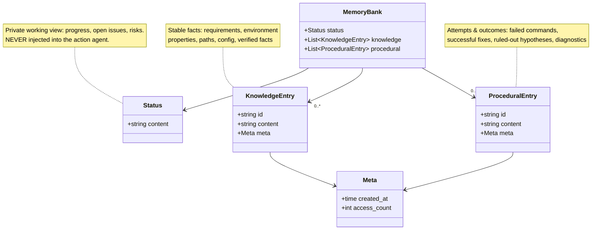

# Part 04 — Memory Bank & Phase-1 Tools

> **Read this when:** implementing the data model and the edit interface.
>
> **TL;DR:** Bank `B_t = (s_t, K_t, P_t)`: **status** is the memory agent's private scratch-state; **knowledge** holds stable facts; **procedural** holds attempts and outcomes. Phase 1 edits the bank *only* through four tool calls executed in order — no free-form rewriting. Entries are short, tagged, and ID-addressable.

## 1. The three components (§3.2)

| Component | Holds | Examples (from the paper) | Shown to action agent? |
|---|---|---|---|
| `status` (s_t) | The memory agent's **private** view of progress, open issues, unresolved risks | *illustrative:* "tests 3/7 passing; root cause of write failure unconfirmed; user not yet authenticated" | **Never** |
| `knowledge` (K_t) | Relatively **stable facts** expected to remain true during the task | task requirements, environment properties, file paths, configuration details, user- or tool-verified facts, evaluation-relevant observations | Only via Phase-2 reminders |
| `procedural` (P_t) | **Attempts and outcomes** | commands that failed, fixes that succeeded, hypotheses ruled out, diagnostic signals, empirical improvements | Only via Phase-2 reminders |

Why `status` is private: it lets the memory agent "maintain a working model of the task **without polluting the action agent's context**."

Why knowledge vs. procedural: the split "encourages the memory agent to distinguish **constraints** from **procedural evidence**" — what is *true* vs. what was *tried and what happened*.

## 2. Entry anatomy

Each knowledge/procedural entry consists of:

- **id** — a short identifier; enables explicit update/delete of stale entries later,
- **content** — natural language, written in a "compact tagged format, such as environment facts, paths, task facts, bugs, and performance observations",
- **metadata** — creation time and access statistics.

*Illustrative reconstruction* of the tagged style (the paper describes the style but prints no literal entries):

```
K1 [env]  container has gcc 12; no network access
K2 [path] tests live at /app/tests/test_parser.py
K3 [task] output MUST be a valid JSON array (hidden verifier checks this)
P1 [bug]  regex fails on single-digit IPv4 octets (e.g. "1.2.3.4")
P2 [perf] naive loop 45s; vectorized version 3s — keep vectorized path
```



**Paper gap:** exact tag vocabulary, entry size limits, bank size limits, eviction/dedup policy, and how access statistics are *used* are all unspecified. (We should record access stats from v1 even if unused — cheap now, useful later.)

## 3. Phase 1 = a constrained edit program (§3.3)

At each memory step, the memory agent returns a **list of predefined tool calls** (possibly empty). It does **not** rewrite the bank directly.

| Tool | Effect |
|---|---|
| `memory_update_status` | Update the private status field (progress tracking; used only by the memory agent) |
| `memory_save_knowledge` | Save an important fact: task requirements, environment facts, file paths, API details, key constraints from the task description |
| `memory_save_procedural` | Record experience: debugging experience, failed approaches, solutions, error patterns, successful fixes, performance observations |
| `memory_delete` | Remove an outdated or incorrect entry by its identifier |

Execution contract:

1. The system executes the returned calls **in order**; the result is the updated bank `B_t`.
2. **Zero calls is legal** → the bank is left unchanged.
3. Output is "a sequence of bank edits, **not a free-form summary** of the trajectory."

Design rationale: explicit, constrained management "lets the memory agent externalize execution state such as unsatisfied requirements, verified environment facts, failed commands, and successful fixes while keeping the bank structured across long trajectories."

## 4. Implementation checklist (derived — feeds spec 001)

- Bank is **per-run execution state**, created at task start. Cross-session persistence is *not* part of the paper.
- CRUD surface: append (knowledge / procedural), replace-status, delete-by-id. **Paper gap:** there is no in-place entry-edit tool — updating an entry appears to mean delete + re-save.
- Bank must be serializable (JSON) for observability and debugging.
- Track access statistics on read/injection even if v1 never consumes them.

---

**Next:** [part 05 — how the updated bank becomes (or suppresses) a reminder](part_05_intervention_policy.md)
