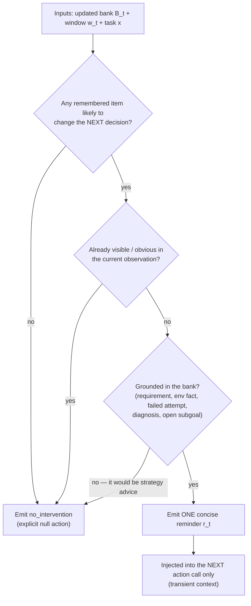

# Part 05 — Intervention Policy (Phase 2)

> **Read this when:** writing the Phase-2 prompt/policy, or debugging over- and under-intervention.
>
> **TL;DR:** Given (task, window, updated bank), output exactly one of: a single concise memory-grounded reminder (`<context_for_action>…`) or explicit silence (`<no_intervention/>`). Intervene only when a remembered item is likely to change the **next** decision. Never advise strategy, restate what is visible, or plan for the actor. Ablations show that removing either the silence option or the bank hurts balanced performance.

## 1. The contract (§3.3, Phase 2)

- **Inputs:** task `x`, recent window `w_t`, **updated** bank `B_t` (Phase 2 runs after Phase 1).
- **Output:** exactly one of reminder `r_t` or null intervention `∅`. The null is "an explicit action", not a fallback.
- Phase 2 **never modifies the bank**.
- A reminder is injected into the next action-agent call as **transient** memory context (part 03 §5); silence leaves the call byte-identical to baseline.

## 2. When to intervene — the paper's positive list

Useful interventions are reminders of:

1. **requirements that are about to be violated**,
2. **environment facts that explain the current observation**,
3. **previous attempts that should not be repeated**,
4. **diagnoses that remain relevant**,
5. **open subgoals that are being neglected**.

## 3. When to stay silent — the negative list

The memory agent is explicitly discouraged from:

- giving **broad strategic advice** (that is the advisor-model failure mode),
- **restating information already visible** in the current observation,
- **taking over the action agent's planning**.

> "Intervention timing is part of the memory policy rather than a consequence of every memory update." (§3.3)

The asymmetry that motivates all of this: "unnecessary interventions can be **harmful rather than merely redundant**" (§2.3) — they add latency, consume tokens, distract from local progress, and can trigger pointless verification detours.



## 4. What good interventions look like in practice (Table 3, §4.4)

| Mechanism | Typical memory content | Representative examples |
|---|---|---|
| Requirement / policy reactivation | Task or domain rule about an allowed action | τ² airline compensation rules; retail modification rules |
| Environment grounding | Runtime facts, paths, tool limitations, system quirks | Terminal-Bench Git server setup; ARS file-write failure |
| Failure-loop avoidance | Previous attempts and why they failed | adaptive rejection sampling; telecom diagnostic retries |
| Diagnostic carryover | Root cause of a bug or negative signal | regex edge cases; SQLite gcov configuration |
| Progress / entity tracking | Which user, order, line, branch, or subgoal is active | τ² telecom line lookup; retail authentication state |

**Timing pattern:** "Successful interventions often occur **immediately before a state-changing tool call**, reminding the agent of authentication requirements, eligibility conditions, one-shot tool limits, or policy clauses not enforced" (§4.4).

Two worked examples from τ² airline:

- User claims Gold status; tool output shows Regular. The baseline compensates per the claim; with memory, the actor is reminded to **rely on verified records** → correct behavior.
- A reminder reactivates the policy clause "basic-economy flights cannot be modified" right before an invalid modification would have been made.

*Illustrative reconstruction* of a reminder (format not printed in the paper):

```
<context_for_action>
Before modifying this reservation: knowledge K3 — airline policy says
basic-economy flights cannot be modified. The current request targets a
basic-economy segment; check eligibility or offer alternatives instead.
</context_for_action>
```

## 5. Observed failure modes — calibration errors (§4.4)

The remaining failures are "primarily calibration errors rather than failures of memory storage":

1. surfacing a **speculative inference with too much confidence**,
2. **repeating information** the action agent already knows,
3. raising a **plausible but unnecessary concern** that causes extra verification work.

These motivate the training study (part 07): SFT teaches the interface and restraint; RL specifically improves the *when-to-speak* decision.

## 6. Prompting notes for our implementation (derived — feeds spec 002)

The Phase-2 prompt must carry: the positive/negative lists above; the full bank (with IDs and tags); the trajectory window; an instruction to ground every reminder in specific bank entries (consider requiring cited entry IDs for observability); and the strict output contract (`<context_for_action>` xor `<no_intervention/>`).

**Paper gap:** the actual Phase-1/Phase-2 prompts are not published in the PDF. They may exist in the authors' repo (unvetted) — worth checking before we write our own from scratch.

---

**Next:** [part 06 — the evidence](part_06_evaluation_and_ablations.md) · [part 07 — training the policy](part_07_training_open_weight_memory.md)
