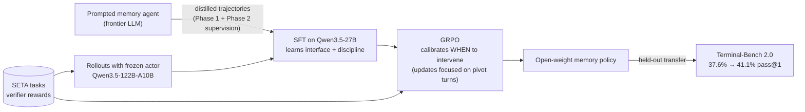

# Part 07 — Training an Open-Weight Memory Policy

> **Read this when:** you care about replacing the frontier memory sidecar with a trained small model, or about whether "when to intervene" is learnable at all.
>
> **TL;DR:** Frozen Qwen3.5-122B-A10B actor + trainable Qwen3.5-27B memory agent, trained on SETA terminal tasks. SFT distills the prompted frontier memory agent (teaches the interface); GRPO calibrates *when* to intervene, with updates focused on "pivot turns" to fight sparse rewards. The headline lesson: an **untrained** memory agent *hurts* (0.709 → 0.693 reward); SFT recovers (0.720); GRPO improves further (0.734); and the gain transfers to held-out Terminal-Bench (37.6% → 41.1%).

## 1. Why train at all (§3.5, §4.5)

- The prompted frontier memory agent "adds a frontier-model call at each memory step" — cost and latency.
- Its "intervention decisions may be imperfectly calibrated" (see the calibration failures in part 05 §5).
- Important framing: **the architecture does not require training.** This study is "an early exploration of whether the same intervention policy can be learned rather than only prompted." Only the memory agent is trained; the action agent stays frozen.

## 2. Setup

| Piece | Choice |
|---|---|
| Action agent (frozen) | Qwen3.5-122B-A10B |
| Memory agent (trainable) | Qwen3.5-27B |
| Training environment | **SETA** — "Scaling Environments for Terminal Agents" (Shen et al. 2026, camel-ai): executable terminal-agent tasks with **verifier rewards**; used for both SFT and RL |
| Held-out transfer | Terminal-Bench 2.0 (85-task set) |

## 3. Stage 1 — SFT (imitation)

- Distills trajectories from the **prompted** memory agent, supervising **both** Phase-1 bank operations and Phase-2 intervention decisions.
- What it teaches: "the interface and basic discipline of memory management: **compact writing, updating stale state, and avoiding unnecessary reminders**."
- What it cannot do: optimize the *downstream effect* of interventions — imitation ≠ outcome.

## 4. Stage 2 — GRPO (calibration)

- Goal: "not to maximize memory usage, but to improve the intervention policy: … when remembered execution state is likely to help the next action decision, and **when silence is preferable**."
- The credit-assignment problem: task-level verifier rewards are **sparse over many memory calls** per episode.
- The fix: "focus updates on **pivot turns** that labeled offline rollouts identify as likely to affect downstream success."

## 5. Results (Table 4, verbatim)

**(a) SETA validation** (average verifier reward; solved counts — validation-set size not stated):

| Setup | Avg. reward | Solved | Δ |
|---|---|---|---|
| Action only, no memory | 0.709 | 56 | — |
| + Qwen3.5-27B **base** memory | 0.693 | 54 | **−0.016** |
| + SFT memory | 0.720 | 58 | +0.011 |
| + GRPO memory | **0.734** | 58 | **+0.025** |

**(b) Transfer to Terminal-Bench 2.0** (n = 85):

| Setup | Pass@1 | Δ |
|---|---|---|
| Qwen3.5-122B-A10B action only | 37.6% | — |
| + trained Qwen3.5-27B memory | **41.1%** | **+3.5 pp** |

## 6. Lessons

1. **Uncalibrated memory is net-negative.** The base 27B memory agent *reduces* reward (−0.016) and solved count (56 → 54). Practically: do **not** bolt an unprompted/uncalibrated memory sidecar onto a working agent — this is the strongest warning in the paper.
2. **SFT teaches format; RL teaches judgment.** SFT recovers the loss (+0.011); GRPO more than doubles the gain (+0.025) — "RL improves the decision of **when remembered state should enter the control loop**."
3. **Transfer is real but partial.** +3.5 pp on held-out Terminal-Bench vs. +8.3 pp for the prompted Opus memory agent on the same benchmark — the authors call it "partial transfer."
4. Reward moves more than solved counts (GRPO ties SFT at 58 solved while reward rises) — verifier reward is the denser signal.

## 7. Implications for our implementation

- The **prompted architecture is the deliverable**; training is an optional later phase.
- If we ever train, we need: (a) structured logging of every Phase-1/Phase-2 decision (trajectory distillation data), (b) a verifier-reward environment (SETA-like), (c) a pivot-turn labeling pipeline. Designing v1's logging with this in mind is cheap now and valuable later.

---

**Next:** [part 08 — limits & open questions](part_08_limits_and_open_questions.md)
