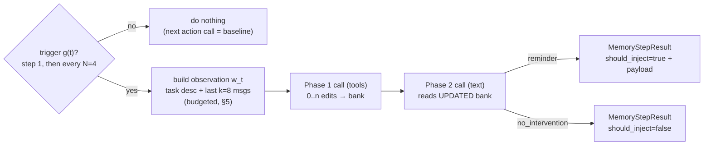

# Spec 002 — Two-Phase Memory Agent

**Status:** v1 — accepted for M1/M2, 2026-07-17. *Planning artifact: interfaces below are normative contracts; no code exists yet.*
**Implements:** FR-1, FR-2, FR-5, FR-6, FR-7, FR-8, FR-9 of [spec 000](000_scope_and_decisions.md).
**Consumes:** [spec 001](001_memory_bank.md) (the bank + four ops). **Consumed by:** spec 003 (harness adapter wires this into `create_agent`).
**Closes gaps:** G1 (prompts), G2 (injection payload), G6 (sync model), G7 (N, k), G8 (wrong-reminder handling).
**Grounding:** [part 03](../docs/context/part_03_architecture_and_control_loop.md), [part 04](../docs/context/part_04_memory_bank_and_tools.md), [part 05](../docs/context/part_05_intervention_policy.md) (paper §3); [part 09](../docs/context/part_09_authors_reference_implementation.md) (authors' prompts/mechanics); [de-risk memo](../docs/research/2026-07-17_tooling_derisk.md) (Ollama/4 GB budgets, N=4).

---

## 0. TL;DR

The memory agent `π_M` is a provider-agnostic orchestrator. When the trigger fires (step 1, then every **N=4** steps), it runs **two independent LLM calls** against one shared local model (`qwen3:4b` via Ollama):

- **Phase 1 (tools):** given the task, the recent window, and the current bank, emit 0..n bank-edit tool calls → executed in order against the spec-001 bank.
- **Phase 2 (text):** given the *updated* bank + window, emit **exactly one** `<context_for_action>…</context_for_action>` reminder **or** `<no_intervention/>`.

A reminder becomes a **transient injection payload** + a **pending-reminder flag** that spec 003's middleware attaches to the action agent's *next* call only. Silence changes nothing. Everything is logged (FR-8). The whole design is dominated by one constraint: **everything must fit a shared `num_ctx=4096` budget** on 4 GB VRAM (§5).



## 1. Scope

**In:** the memory-agent orchestrator, its LLM-client contract, the two phase prompts + I/O contracts, the trigger, the observation/budget builder, the injection *payload* shape, per-step logging, config surface, and mock-LLM acceptance criteria.

**Out (owned elsewhere):** the bank data model + ops (spec 001); wiring into `create_agent`, the `before_model`/`wrap_model_call` hooks, and *where* the payload lands in the prompt (spec 003); eval tasks (spec 004). The action agent itself is never touched (FR-1).

## 2. Components

| Component | Responsibility |
|---|---|
| `LLMClient` (interface) | One method: `complete(system, user, tools?, response_schema?) -> LLMResponse`. Provider-agnostic; default impl targets Ollama's OpenAI-compatible endpoint. |
| `TriggerPolicy` (interface) | `should_run(step) -> (bool, reason)`. Default: first step + every N. |
| `ObservationBuilder` | Assembles the budgeted `w_t` (task desc + windowed messages) and the bank render, honoring the token budget (§5). |
| `MemoryAgent` | Orchestrates one memory step: Phase 1 → execute ops on the bank → Phase 2 → `MemoryStepResult`. Holds config. |

`MemoryAgent` depends on: a `MemoryBank` (spec 001), an `LLMClient`, a `TriggerPolicy`, an `ObservationBuilder`, and a `MemoryAgentConfig`.

## 3. LLM client contract

```
LLMResponse = {
  content: str,                 # raw text (may contain <think>…</think>, tool-call XML)
  tool_calls: list | None,      # structured tool calls if the backend returned them
  reasoning: str | None,        # separated reasoning, if the backend provides it
  prompt_tokens: int, completion_tokens: int, latency_ms: int
}
```

- **One model, two roles.** Action agent and memory agent share the *same* Ollama model instance (OD-3, memo §4) — no swap. The memory agent is distinguished only by its system prompts (§6, §7), never by a different model.
- **Ollama config (from memo §4), owned as env/config, asserted at startup:** `model=qwen3:4b` (Q4_K_M), `temperature=0`, `num_ctx=4096`, `OLLAMA_FLASH_ATTENTION=1`, `OLLAMA_KV_CACHE_TYPE=q8_0`, `OLLAMA_NUM_PARALLEL=1`, long `keep_alive`. The client SHOULD verify 100 % GPU residency is *expected* and surface a warning otherwise (real check is M2.5's calibration harness).
- **Structured tool calls.** Phase 1 passes `tools` (§6) and, when the backend supports it, a JSON schema to constrain arguments (`response_schema`/Ollama structured outputs) — the memo's lever to push a 4 B model's valid-call rate >90 %. The client MUST also tolerate backends that ignore the schema (fallback parser, §6.3).
- **Fallback ladder** (`qwen3:4b → phi4-mini → qwen3:1.7b`) is a config change of `model`; the contract is identical. Model choice is provisional until M2.5.

## 4. Trigger `g(t)` (FR-2, FR-9)

- Default: **fire on step 1, then every N steps**, `N=4` (deployment default, D4). `N` and "fire on first step" are config.
- Interface `TriggerPolicy.should_run(step) -> (bool, reason)` so alternative triggers (tool-error, failed-test, repeated-command — part 03 §4) drop in later without touching `MemoryAgent`. Only the fixed-interval policy ships in v1.
- The trigger decides whether a memory step runs *at all*. If it doesn't fire, the action agent's next call is byte-identical to baseline (FR-7).

## 5. Observation & the 4 GB token budget (the binding constraint)

Both phase calls must fit `num_ctx=4096` **including the model's own completion** (Ollama shares prompt+response in one window). The `ObservationBuilder` enforces a token budget; numbers below are **starting points calibrated at M2.5**, all config:

| Segment | Budget (tokens) | Policy if over |
|---|---|---|
| Completion headroom (tool calls / reminder) | ~600 | n/a (reserved) |
| System prompt (Phase 1 or 2) | ~450 | fixed text (§6/§7) |
| Bank render | ~900 | **selection policy** (below) |
| Task description | ~400 | head+tail truncate with marker |
| Windowed messages (`k=8`) | ~1700 | per-message truncate; drop oldest first |

**Bank-render selection policy (refines spec 001 §7 for small `num_ctx`).** Spec 001 defers BM25 prefiltering until >50 entries, but the **token budget binds first** here: if the full bank render exceeds its ~900-token slice, select entries to fit by (a) **recency** (newest `created_step` first) in v1, with (b) BM25-against-observation as the M2.5+ upgrade. Rendered entries always keep their `[id]` (needed for citation, D1). This is a *view* for the prompt only — the bank itself is never truncated. → **feeds a spec 001 amendment note.**

**Windowing.** Task description is *always* included (grounding), then the last `k=8` messages, each truncated to a per-message cap so the window fits its slice; oldest dropped first. Terminal/tool outputs are truncated hard (a 4 B budget cannot afford the authors' ~10 KB/message). Message entries render as the authors do (analysis / plan / commands / output — part 09 §6), compacted.

**Why this matters:** with `max_entry_chars=1000` (~250 tokens) a naïve "render all entries" blows 4096 after ~4 entries. Compact entries (the Phase-1 prompt demands them) + this budget are what make the whole thing run on your card.

## 6. Phase 1 — bank management

**Inputs:** system prompt (§6.1), user prompt = `[step] + [budgeted bank render] + [budgeted observation] + [instruction]`. **Tools:** the four ops (§6.2). **Output:** an ordered list of tool calls → executed against the bank via spec 001's ops, in order (spec 001 EC-1). Zero calls = bank unchanged (legal no-op). Phase 1 is **one forward pass** returning 0..n calls (like the authors), not one pass per call.

### 6.1 System prompt
Adapted from the authors' `PHASE1_SYSTEM` (part 09 §2), verbatim in structure with our deltas: (i) reference **our** tag conventions `[ENV] [PATH] [FACT]` / `[BUG] [PERF]` (spec 001 §5); (ii) demand compact entries explicitly (the budget depends on it); (iii) state that IDs are stable and deletion is by ID. Full text in **Appendix A**. Apache-2.0 attribution retained (part 09 §8).

### 6.2 Tool schemas
Four tools mapping 1:1 to spec 001 ops, each `content: str` (or `memory_id: str` for delete), JSON-schema-constrained:

| Tool | Args | → spec 001 op |
|---|---|---|
| `memory_save_knowledge` | `content` | `save_knowledge` |
| `memory_save_procedural` | `content` | `save_procedural` |
| `memory_update_status` | `content` | `update_status` |
| `memory_delete` | `memory_id` | `delete` |

Empty/whitespace `content` or unknown `memory_id` → the op records a failed `MemoryOperation` (spec 001 EC-2), execution continues.

### 6.3 Small-model robustness (from part 09 §5, critical for 4 B)
- **Fallback XML tool-call parser.** If structured `tool_calls` are absent or have empty `content` but the raw text contains `<tool_call>…<function=…><parameter=content>…`, parse them out. Required — 4 B models frequently emit tool calls as text.
- **Strip `<think>…</think>`** before parsing (config `keep_thinking=false`).
- Both behaviors are unit-tested (§10).

## 7. Phase 2 — intervention selection

**Inputs:** system prompt (§7.1), user prompt = `[step] + [UPDATED bank render] + [budgeted observation] + [decision instruction]`. **Output contract:** exactly one of
- `<context_for_action>…</context_for_action>` → a reminder, or
- `<no_intervention/>` → silence.

**Rules:**
- Phase 2 **never edits the bank** (FR-5). It reads the post-Phase-1 bank.
- **≤ 1 reminder** per step (FR-5).
- **Silence-biased by default** — the prompt's default is `<no_intervention/>` (already the authors' design, part 09 §3; confirms spec 000's silence-bias intent).
- **Fail-silent parsing (G8):** no recognizable tags, or empty `<context_for_action>` → treat as `<no_intervention/>`. A malformed memory step must never crash or spam the action agent.
- **Grounding + citation (deviation D1):** the prompt requires every reminder to cite the bank entry `[id]`(s) it rests on. The parser extracts `cited_ids`; the step logs them and the run tracks *citation rate*. This is a **soft contract** (logged, not hard-rejected) — a 4 B model will sometimes miss it, and hard-failing would suppress otherwise-useful reminders. Reminders grounded in the task description (not yet a bank entry) are allowed but discouraged by the prompt.
- **No strategy / no restating visible info / no plan takeover** (FR-6) — carried from the authors' prompt.

### 7.1 System prompt
Adapted from `PHASE2_SYSTEM` (part 09 §3): the "Selective Attention" framing, the when-to-intervene / when-to-stay-silent lists, the strict output format, and the silence default — **plus** our D1 citation requirement ("cite the `[id]` of each memory you rely on"). Full text in **Appendix B**. Apache-2.0 attribution retained.

## 8. Injection payload (G2) — produced here, placed by spec 003

When Phase 2 emits a reminder, `MemoryAgent` returns a payload; **spec 003** decides placement (via `request.override(system_message=…)`, memo §2). Payload = the authors' `<memory_context>` wrapper (part 09 §6), hedged:

```
<memory_context>
The following context from memory may be relevant to your current work
(these are observations, not directives — verify before acting):
{reminder_text}
</memory_context>
```

Semantics this spec guarantees for spec 003 to rely on:
- **Transient / one-shot** (FR-7): the payload applies to exactly one upcoming action call; `MemoryStepResult.should_inject` + the payload are consumed once, then the pending state clears.
- **Status is never in the payload** — Phase 2 only ever emits `<context_for_action>` text; the private `status` field is structurally excluded (defense-in-depth with spec 001 AC-3; part 09 §4 war story).
- Silence ⇒ no payload ⇒ spec 003 leaves the next call unchanged.

## 9. Orchestration & result

`MemoryAgent.process(observation_inputs, step) -> MemoryStepResult`:

1. (Caller/trigger has already decided this step runs.)
2. Build budgeted observation + bank render (§5).
3. **Phase 1 call** → parse ops (structured or fallback) → execute in order on the bank.
4. Rebuild bank render (now updated).
5. **Phase 2 call** → parse decision → build payload or none.
6. Assemble + return `MemoryStepResult`; emit the step log (§10).

```
MemoryStepResult = {
  step: int,
  operations: list[MemoryOperation],     # from spec 001
  should_inject: bool,
  reminder_text: str | None,             # unwrapped
  injection_payload: str | None,         # wrapped (<memory_context>…), for spec 003
  cited_ids: list[str],                  # D1
  metrics: { phase1_tokens, phase2_tokens, phase1_ms, phase2_ms }
}
```

**Two independent calls, not a shared conversation.** The authors' code builds a *fresh* prompt per phase (each embeds bank+observation) rather than threading a chat history — we do the same. It keeps each prompt inside the `num_ctx` budget and makes the two forward passes independently loggable. Cost per triggered step = exactly **2 forward passes**.

## 10. Logging (FR-8) & metrics

Per triggered memory step, append one JSONL record: `step`, phase-1 `operations` (action/id/content/success), phase-2 `should_inject` + `reminder_text` + `cited_ids`, both prompts + raw responses (for future SFT distillation, part 07 §7), and `metrics`. Per run, summarize: `trigger_count`, `injection_count`, `noop_count`, **`intervention_rate = injection_count / trigger_count`**, `citation_rate`, total memory tokens, and bank growth. Intervention rate + token/latency overhead are first-class outputs (deviation D3, closes G9) — the calibration stats the paper never reports.

## 11. Config surface (`MemoryAgentConfig`)

`model`, `temperature=0`, `trigger_interval N=4`, `trigger_on_first_step=true`, `window_k=8`, `num_ctx=4096` + the §5 budget slices, `max_reminder_chars`, `use_structured_tools=true`, `use_fallback_parser=true`, `keep_thinking=false`, `require_citation=true (soft)`. All overridable; the M2.5 calibration harness sets the final `N`, `num_ctx`, and budget numbers.

## 12. Acceptance criteria (→ M1/M2 tests, driven by a scripted mock `LLMClient`)

| # | Criterion |
|---|---|
| AC-1 | Trigger fires on step 1 and every N thereafter; not on intermediate steps (`TriggerPolicy` unit test) |
| AC-2 | Phase-1 tool calls execute against the bank **in returned order** (mock returns `[save A, delete idA]` → empty bank; reversed → one entry + one failed op) |
| AC-3 | Empty Phase-1 (no tool calls) → bank serialization-identical (legal no-op) |
| AC-4 | Phase-2 `<context_for_action>X</context_for_action>` → `should_inject=true`, `reminder_text=X`; `<no_intervention/>` → `should_inject=false` |
| AC-5 | Phase-2 with **no tags / empty context** → `should_inject=false` (fail-silent, G8), no crash |
| AC-6 | Phase 2 does **not** mutate the bank (bank identical before/after Phase 2) |
| AC-7 | At most one reminder per step; `injection_payload` wraps `reminder_text` in the `<memory_context>` hedge |
| AC-8 | `status` sentinel never appears in `injection_payload` for any bank state (defense-in-depth) |
| AC-9 | Fallback XML parser: mock returns text `<tool_call><function=memory_save_knowledge><parameter=content>…` with empty structured `tool_calls` → op executed |
| AC-10 | `<think>…</think>` stripped before Phase-1 op parsing and Phase-2 decision parsing |
| AC-11 | Observation builder keeps each phase prompt within the configured `num_ctx` budget (task desc + window + bank render truncated per §5); task description always present |
| AC-12 | Phase 2 sees the **post-Phase-1** bank (mock asserts an entry saved in Phase 1 is present in the Phase-2 prompt) |
| AC-13 | `cited_ids` extracted when the reminder references `[id]`s; `intervention_rate` + `citation_rate` computed correctly over a scripted run |

## 13. Handoffs to spec 003

- Spec 003's `before_model` builds the observation inputs and (when the trigger fires) calls `MemoryAgent.process(...)`; it stores `should_inject` + `injection_payload` as the **pending-reminder flag** in agent state.
- Spec 003's `wrap_model_call` fires on *every* call, checks the pending flag, applies `request.override(system_message=payload)` **only when set**, then clears it (memo §2 — "next call only" is our gating, not the hook).
- This spec guarantees the payload is transient, status-free, and ≤1 per step; spec 003 guarantees FR-1 (base prompt/tools/decoding untouched) and FR-7 (byte-identical baseline on silence).

## 14. Decision log

| # | Decision | Rationale |
|---|---|---|
| D-002-1 | Two independent LLM calls per step, fresh prompt each | Fits `num_ctx=4096`; independently loggable; matches authors' actual code |
| D-002-2 | Citation of bank IDs is a **soft** contract (logged, not enforced) | D1 auditability without suppressing useful reminders from an imperfect 4 B model |
| D-002-3 | Token-budget bank selection binds before spec 001's 50-entry BM25 trigger | 4 GB `num_ctx` is the real limit; recency-first selection in v1, BM25 later |
| D-002-4 | Fail-silent on malformed Phase-2 output | An erratic small model must degrade to silence, never to noise/crash (G8) |
| D-002-5 | Structured tool schema + `temperature=0` + fallback XML parser together | Push 4 B valid-tool-call rate >90 % (memo) while surviving backends that ignore schemas |

## 15. Appendices

- **Appendix A — Phase-1 system prompt (final adapted text).** Base = authors' `PHASE1_SYSTEM` (part 09 §2, Apache-2.0) + our tag/compactness/ID deltas. *To be pasted in full when M2 implementation begins; the base text is already captured verbatim in part 09 §2.*
- **Appendix B — Phase-2 system prompt (final adapted text).** Base = authors' `PHASE2_SYSTEM` (part 09 §3, Apache-2.0) + the D1 citation requirement. *Same note; base captured in part 09 §3.*

> Appendices hold the literal prompt strings we ship. They are deliberately deferred to implementation so the prompt text is version-controlled next to the code that sends it; the authoritative base text lives in part 09 today.
