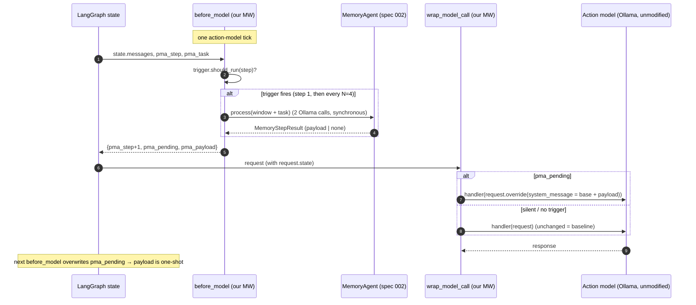

# Spec 003 — Harness Adapter (LangChain `create_agent` middleware)

**Status:** v1 — accepted for M2, 2026-07-18. *Planning artifact: interfaces below are normative contracts; no code exists yet.*
**Implements:** FR-1, FR-7, FR-9 of [spec 000](000_scope_and_decisions.md); the OD-2 resolution (`create_agent` + one custom middleware).
**Consumes:** [spec 002](002_two_phase_agent.md) (`MemoryAgent.process` + the injection payload contract). **Consumed by:** spec 004 (eval driver runs the assembled agent).
**Closes gaps:** G10 (harness coexistence / wiring).
**Grounding:** [de-risk memo §2](../docs/research/2026-07-17_tooling_derisk.md) (verified LangChain API); [part 03 §2](../docs/context/part_03_architecture_and_control_loop.md), [part 09 §6](../docs/context/part_09_authors_reference_implementation.md) (authors' injection mechanics).

---

## 0. TL;DR

One custom `AgentMiddleware` turns an unmodified LangChain `create_agent` action agent into a memory-enabled one, using two lifecycle hooks:

- **`before_model(state, runtime)`** — read the recent message window + task from LangGraph state; if the trigger fires, run `MemoryAgent.process(...)` (spec 002) synchronously; write the resulting one-shot injection payload (or none) into custom state.
- **`wrap_model_call(request, handler)`** — if a payload is pending, `request.override(system_message = base + payload)` for **this call only**, then let the flag self-clear; otherwise pass the request through untouched.

The action agent's base prompt, tools, model, and decoding are never modified (FR-1); on silence the call is byte-identical to baseline (FR-7). The middleware is the **only** LangChain-aware code — the memory agent (spec 002) and bank (spec 001) stay harness-agnostic behind a `MemorySidecar` protocol (§3), so the documented fallback (a hand-rolled Ollama loop) can implement the same protocol later without touching the core.



## 1. Scope

**In:** the `AgentMiddleware` subclass and its two hooks; the custom state keys; state→observation extraction; injection composition + one-shot semantics; action-agent assembly (`create_agent(... , middleware=[mw])`) pointing at Ollama; the harness-agnostic `MemorySidecar` protocol; version-pinning checklist; acceptance criteria.

**Out:** the memory-agent logic, prompts, budgets (spec 002); the bank (spec 001); eval tasks/metrics reporting (spec 004). **The action agent is never subclassed or prompt-edited** (FR-1) — memory is added purely as attached middleware.

## 2. The two hooks (normative)

### 2.1 `before_model(state, runtime) -> dict | None`
Runs before every action-model call. Steps:

1. **First tick only:** capture the task description (first `HumanMessage` in `state.messages`) into `pma_task` and seed the bank/step counter.
2. Compute `step` from `pma_step`; ask `TriggerPolicy.should_run(step)` (spec 002 §4; default step 1 + every N=4).
3. **If not triggered:** return `{"pma_step": step+1, "pma_pending": False, "pma_payload": None}` — no memory call, nothing to inject.
4. **If triggered:** build observation inputs from `pma_task` + the last `k=8` messages of `state.messages` (§4), call `MemoryAgent.process(observation, step)` **synchronously**. Return `{"pma_step": step+1, "pma_pending": result.should_inject, "pma_payload": result.injection_payload}`.

`before_model` **rewrites the pending keys every tick**, which is what makes injection one-shot without an explicit clear (a reminder set on tick T is overwritten to `False/None` on tick T+1). `after_model` clearing is an optional belt-and-suspenders, not required.

### 2.2 `wrap_model_call(request, handler) -> ModelResponse`
Runs around every action-model call:

```
if request.state.get("pma_pending"):
    base = request.system_message or ""            # preserve the action agent's base prompt
    merged = base + "\n\n" + request.state["pma_payload"]
    return handler(request.override(system_message=merged))   # this call only
return handler(request)                                        # untouched → baseline
```

- `override(...)` returns a **new immutable** request scoped to this single call; base config is unchanged (memo §2). This is the entire mechanism behind FR-7.
- **Composition, not clobber:** we set `system_message` to `base + payload`, reading `base` from `request.system_message` so the action agent's own system prompt survives. (`override(system_message=X)` *replaces* the field — never pass the payload alone.)
- **Never** touch `request.tools`, `request.model`, `request.tool_choice`, `request.model_settings` (FR-1).

### 2.3 Injection placement (config, mirrors authors' `injection_method`)
- `injection_method="system"` (default): compose into `system_message` as above — one system message, transient, never enters persisted history.
- `injection_method="user_turn"`: instead `request.override(messages = request.messages + [HumanMessage(payload)])` — matches the authors' Terminal-Bench config (part 09 §6). **Remember `override(messages=…)` replaces the list**, so we must pass `request.messages + [...]`, never `[...]` alone.
Both are per-call and leave `state.messages` unmodified, so neither persists into history (verified by AC-6).

## 3. Harness-agnostic seam (`MemorySidecar` protocol)

To honor OD-2 ("core stays harness-agnostic"), the memory agent never imports LangChain. The adapter is the boundary:

```
# core-side (no LangChain): what any harness must be able to do
MemorySidecar (protocol):
    observe(window_messages, task) -> ObservationInputs
    step() -> MemoryStepResult                      # runs trigger + MemoryAgent.process
    # the harness applies result.injection_payload transiently to the next call
```

- `LangChainMemoryMiddleware` (this spec) implements the harness side: it extracts `window_messages`/`task` from LangGraph state and applies the payload via `override`.
- A future `OllamaLoopAdapter` (the documented fallback, spec 000 OD-2) would implement the same handoff inside a hand-rolled `/api/chat` loop. Neither touches `MemoryAgent`.

**No re-entrancy:** `MemoryAgent`'s two Ollama calls go through its **own** `LLMClient` (spec 002 §3), *not* the `create_agent` graph — so they never recurse through this middleware. The memory calls happen inside `before_model`, never nested inside `wrap_model_call`, so the model call is wrapped exactly once (this resolves the memo's "confirm no pathological nesting" open item).

## 4. Reading the window from LangGraph state

- `pma_task`: the first `HumanMessage.content`, captured on the first tick (the paper's task description `x`).
- Window `w_t`: the last `k=8` entries of `state.messages`, converted from LangChain message objects (`AIMessage`/`ToolMessage`/`HumanMessage`) into spec 002's `ObservationBuilder` input, then **budgeted to `num_ctx`** (spec 002 §5). Tool results (LangChain `ToolMessage`) are the analogue of the authors' terminal output and get the hard per-message truncation.
- The adapter converts message objects → plain records; `MemoryAgent` sees no LangChain types.

## 5. Assembling the action agent

```
action_model = init_chat_model("ollama:qwen3:4b", temperature=0)   # or ChatOllama(...)
memory_mw = LangChainMemoryMiddleware(memory_agent=MemoryAgent(...), trigger=..., injection_method="system")
agent = create_agent(model=action_model, tools=[...], system_prompt=BASE_SYS, middleware=[memory_mw])
```

- **One shared Ollama model** for action + memory (OD-3): `action_model` and `MemoryAgent`'s `LLMClient` both point at `qwen3:4b` with `OLLAMA_NUM_PARALLEL=1`, so their calls serialize against one resident model (no swap, no contention) — memo §4.
- The memory middleware is **purely additive**: removing it from the `middleware=[]` list yields the exact baseline agent (this is how the eval runs baseline vs +memory — spec 004).
- Coexistence with other middleware (e.g., LangChain summarization) is allowed; our middleware only reads the window and adds a transient system addendum (closes G10).

## 6. Custom state keys

The middleware declares extra state channels (via the middleware's state-schema extension): `pma_step: int`, `pma_task: str`, `pma_pending: bool`, `pma_payload: str | None`. The bank and `MemoryAgent` are held on the **middleware instance** (per-run), *not* serialized into graph state — keeps state light and avoids re-serializing the bank each tick. (If LangGraph checkpointing is later enabled, the bank serializes separately via spec 001's JSON, not through state.)

## 7. Version pinning & API-drift checklist (R3)

The seam is verified against current docs (memo §2) but the `langchain`/`langgraph`/`deepagents` 0.6.x line churns. **Before writing code, pin exact versions and re-verify against the installed build:**

- [ ] `AgentMiddleware` base class + how custom state keys are declared (state schema).
- [ ] `before_model` / `wrap_model_call` / `after_model` signatures and return conventions.
- [ ] `ModelRequest` fields: `system_message` present and holding the base prompt; `messages`, `state`, `tools`, `model` accessible.
- [ ] `ModelRequest.override(...)` — confirm `system_message=` supported and that `messages=` **replaces** (not appends).
- [ ] `system_prompt=` is deprecated → use `system_message=`.
- [ ] `create_agent(..., middleware=[...])` accepted; Ollama via `init_chat_model("ollama:...")` or `ChatOllama`.
- [ ] `ModelResponse` import path stable (memo flagged churn in 1.0 alphas).

Record the pinned versions in the eventual `pyproject.toml`; a failing item here blocks M2, and the hand-rolled Ollama loop fallback (§3) removes this risk category entirely if drift proves painful.

## 8. Acceptance criteria (→ M2 tests, with a stub chat model + mock `LLMClient`)

| # | Criterion |
|---|---|
| AC-1 | **Baseline identity (FR-7):** on a silent/no-trigger tick, the request reaching `handler` is unchanged — `system_message`, `messages`, `tools`, `model` identical to the no-middleware agent |
| AC-2 | **Additive-only (FR-1):** with the middleware removed from `middleware=[]`, the agent is byte-identical to baseline; adding it changes nothing until a reminder is injected |
| AC-3 | **Injection composes:** on an inject tick, `handler` receives `system_message == base + "\n\n" + payload`; the base system prompt is fully preserved; `tools`/`model`/`temperature` untouched |
| AC-4 | **One-shot:** the tick after an inject tick carries no injection (pending overwritten by `before_model`); the payload never appears twice |
| AC-5 | **Trigger gating:** `MemoryAgent.process` is invoked only on step 1 and every N; intermediate ticks make no memory call |
| AC-6 | **No history pollution:** after a full run, `state.messages` (persisted history) contains no `<memory_context>` payload — injection was per-call only |
| AC-7 | **No re-entrancy:** the memory agent's own LLM calls do not pass through `wrap_model_call` (call counter on the wrapper counts only action-model calls) |
| AC-8 | **Status privacy end-to-end:** for any bank state, the composed `system_message` never contains the private `status` sentinel (inherited from spec 002 §8 / spec 001 AC-3) |
| AC-9 | **Window extraction:** the observation handed to `MemoryAgent` contains `pma_task` + the last `k` messages, budgeted; no LangChain message objects leak into `MemoryAgent` |
| AC-10 | **`user_turn` mode:** with `injection_method="user_turn"`, the payload arrives as an appended message and `request.messages` for that call = base messages + 1; `state.messages` still unpolluted |
| AC-11 | **Protocol conformance:** `MemoryAgent`/bank import no LangChain symbol; the middleware is the only module importing `langchain`/`langgraph` |

## 9. Decision log

| # | Decision | Rationale |
|---|---|---|
| D-003-1 | Memory step runs in `before_model`, injects in the **same tick's** `wrap_model_call` | The window `before_model` sees = messages up to now; injecting into the immediately-following action call is exactly "reminder into the next action-agent decision" (paper §3.1), and keeps the memory calls out of the wrapped call (no nesting) |
| D-003-2 | One-shot via `before_model` overwriting pending keys every tick | Deterministic, self-clearing; no reliance on `wrap_model_call` writing state (it can't) |
| D-003-3 | Compose payload into `system_message` (default), `user_turn` optional | Idiomatic transient path (memo §2); `user_turn` retained for parity with the authors' TB config |
| D-003-4 | `MemorySidecar` protocol boundary; middleware is the only LangChain-aware code | OD-2 harness-agnostic core; lets the Ollama-loop fallback reuse spec 001/002 unchanged |
| D-003-5 | Bank + `MemoryAgent` live on the middleware instance, not in graph state | Avoids re-serializing the bank each tick; state stays light |

## 10. Handoffs

- **To spec 004 (eval):** construct two agents from the *same* factory — one with `middleware=[memory_mw]`, one without — to get the baseline-vs-memory A/B on identical tasks; read `MemoryAgent`'s run-level metrics (spec 002 §10: intervention rate, citation rate, tokens/latency) for the report. The M2.5 calibration harness (spec 000) reuses this assembly with a fixed probe task.
- **To M2 implementation:** complete the §7 pinning checklist first; the memory agent and bank (specs 001/002) are already harness-independent, so only this adapter binds to LangChain.
