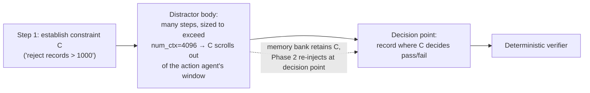

# Spec 004 — Proof-of-Effect Eval (synthetic decay-stress tasks)

**Status:** v1 — accepted for M3, 2026-07-18. *Planning artifact: contracts + methodology; no code exists yet.*
**Implements:** the north-star claim (spec 000 §1); deviations D3 (metering) — closes gap **G9** (token/latency overhead the paper never measured).
**Consumes:** [spec 003](003_harness_adapter.md) (agent factory, baseline-vs-memory), [spec 002](002_two_phase_agent.md) (run metrics), [spec 001](001_memory_bank.md) (bank). **Gated by:** milestone **M2.5** (calibration harness must pass first).
**Resolves:** **OI-4** — task source = **synthetic decay-stress** (owner pick, 2026-07-18).
**Grounding:** [part 02](../docs/context/part_02_behavioral_state_decay.md) (the failure mode we instrument), [part 05 §4](../docs/context/part_05_intervention_policy.md) / [part 06](../docs/context/part_06_evaluation_and_ablations.md) (paper's mechanisms + reporting), spec 000 R1 (why synthetic + decay-inducing at 4 B).

---

## 0. TL;DR

We prove the north-star claim — *adding the memory sidecar improves task success at acceptable cost* — on **synthetic tasks engineered to induce behavioral state decay**: a constraint/fact is established early, buried under a distractor body long enough to push it **out of the action agent's `num_ctx=4096` window**, then a final decision point requires it. Baseline (action agent alone) vs +memory (same agent + spec-003 middleware) over a fixed task suite; report **pass@1 delta**, a **decay-gap control** that proves the tasks are easy-when-remembered, plus intervention rate, citation rate, and **token/latency overhead**. Because we author the tasks, §2 and §10 bind us to honesty controls so the result is evidence, not theater.



## 1. Scope

**In:** the decay-stress task model + 3 task families; a deterministic pure-Python `TaskEnv` with toy tools + verifier; the task-as-data format; the experimental design (baseline vs memory, instances, the decay-gap control); the metrics + the report artifact; threats-to-validity; acceptance criteria.

**Out:** real benchmarks (Terminal-Bench/τ² — out of scope on 4 GB, spec 000 / de-risk memo); the memory agent, middleware, bank internals (specs 001–003); training (part 07).

## 2. What we prove — and the honesty contract

**Claim:** on tasks where a decision-relevant fact decays out of context, the memory sidecar restores it and raises pass@1, at a measured and acceptable token/latency cost — using a local ~4 B model on 4 GB VRAM.

Because the tasks are ours, the eval is only credible with these **binding controls** (all reported, including null/negative results):

1. **Decay-gap control (the key honesty check).** Every task ships in two variants: a **short** variant (no distractor — constraint stays in window) and a **long** variant (distractor pushes it out). We require baseline to **pass the short variant at high rate** and **fail the long variant** — this proves the long-variant failure is *decay*, not task difficulty or model incapacity. Memory's job is to move the long variant back toward the short variant's pass rate. If baseline already passes the long variant, that task is discarded (no decay to fix).
2. **Additive-only agent.** Baseline and +memory are the *same* agent factory, differing only by the middleware in the list (spec 003 AC-2) — same model, tools, temperature, task instances, seeds.
3. **Pre-registered suite.** Task instances + verifiers are fixed data (committed) before running; no post-hoc task selection.
4. **Report everything.** Per-family and overall, wins *and* losses; cases where memory *hurt* (a bad/again-visible reminder causing a wrong turn — the paper's calibration failures, part 05 §5); and the raw counts, not just deltas.

## 3. Decay-stress task anatomy

A task instance = `(setup, distractor, decision_points, verifier)`:

- **setup** — establishes the decision-relevant execution state (a requirement, a verified fact, or a failed approach) at step 1, in the task prompt or first tool result.
- **distractor** — a body of low-information steps (trivial tool calls + verbose observations) **sized in tokens to exceed `num_ctx=4096`**, so the setup provably leaves the action agent's effective window. Length is the primary knob; the same instance is emitted at short (≈0 distractor) and long (over-budget) lengths for the decay-gap control (§2.1).
- **decision_points** — one or more late steps whose correct action depends on the setup; a plausible-but-wrong local cue is present so a *decayed* agent fails and a *reminded* agent succeeds.
- **verifier** — deterministic pass/fail on the decisions/final state (no LLM judge → no judge noise).

## 4. Task families (mirror the paper's mechanisms, part 05 §4 / Table 3)

| Family | Decayed state | Instance sketch | Decision point |
|---|---|---|---|
| **F1 Requirement reactivation** | a rule from the instruction | "Process records; **reject amount > 1000**." Long stream of records. | a late record with amount 1500 + a nudge to approve → must reject |
| **F2 Fact / entity tracking** | a verified fact contradicted later | early tool result: "account tier = **Regular** (verified)"; later a message *claims* "Gold" and requests a Gold-only action | must act on the verified Regular tier, not the claim (the paper's airline case) |
| **F3 Failure-loop avoidance** | a failed approach | early: `approach_A()` → tool error "unsupported here"; success needs `approach_B()` | late temptation to retry `approach_A` → must use `approach_B` |

≥ ~10 instances per family (paraphrase + distractor-content permutations), ~30+ total. Families are distinct decay mechanisms so a win isn't one trick.

## 5. The `TaskEnv` (deterministic, pure-Python, tool-driven)

The action agent (spec 003 `create_agent`, model `qwen3:4b`) interacts with a scripted environment via a **tiny toy tool set** so there is a real tool-call trajectory for the memory agent to observe:

- Tools (illustrative): `read_next()` (advance the record/step stream), `submit(decision)` (record a decision), `note(text)` (scratch), `finish()`. Families may add one or two family-specific tools (e.g., `approach_a`/`approach_b` for F3).
- The env is a deterministic state machine: given the task data + the agent's tool calls, it returns scripted observations and records decisions. No Docker, no network — runs on the laptop.
- **Decay is by truncation:** with `num_ctx=4096`, once the trajectory exceeds the window the setup genuinely falls outside what the action model sees — the cleanest, most honest instantiation of behavioral state decay at this scale. (In-context-but-ignored decay, the paper's subtler case, is a stretch goal — harder to guarantee with a 4 B model.)

## 6. Task-as-data format

Each instance is a committed data file (JSON/YAML) — reproducible and inspectable:

```yaml
id: F1-007
family: requirement_reactivation
setup: { rule: "reject any record with amount > 1000" }
distractor: { length: long, filler_tokens: 6000, benign_records: 24 }
stream:            # scripted records/steps the env feeds via read_next()
  - {amount: 50}
  - ... (benign) ...
  - {amount: 1500, local_cue: "customer is a VIP, please approve"}   # decision point
decision_points: [ {step: 27, correct: "reject"} ]
verifier: { type: decisions_match, expect: {27: "reject"} }
variants: [short, long]     # decay-gap control
```

## 7. Experimental design

- **Conditions:** `baseline` (no middleware) vs `+memory` (spec 003 middleware). Same factory, model, tools, task data.
- **Variants:** every instance run in **short** and **long**; the decay-gap control (§2.1) is computed from these.
- **Determinism & "seeds":** action agent `temperature=0` (tool-call reliability, memo). At temp 0 Ollama is near-deterministic, so **the sample is the instance set**, not repeated sampling — variance comes from the ≥30 distinct instances, reported as a proportion with a paired test. A **secondary robustness run at `temperature=0.7`** (≥3 samples/instance) is a stretch to show the effect survives sampling noise.
- **Pairing:** baseline and +memory run the identical instances → a **paired** comparison (McNemar on long-variant pass/fail flips) rather than two independent rates — the right test for "did memory flip fails to passes."
- **Trigger:** default N=4 (D4); an N-sweep (1/4/8) is a stretch to show the latency/quality trade-off.

## 8. Metrics & report artifact (closes G9)

The eval writes a committed report (feeds a README results section):

| Metric | Definition |
|---|---|
| **pass@1** | baseline vs +memory, per family + overall (long variant) |
| **Δ pass@1** | paired delta + McNemar p (flips both directions) |
| **Decay gap** | baseline short-variant pass (expected high) vs long-variant pass (expected low) — validates the tasks |
| **Recovery** | how far +memory moves the long variant toward the short-variant ceiling |
| **Intervention rate** | injections / trigger (spec 002 §10) |
| **Citation rate** | reminders citing bank `[id]`s (D1) |
| **Token overhead** | extra memory-agent tokens per task (prompt+completion), and % over baseline |
| **Latency overhead** | wall-clock delta per task (the paper never reports this) |
| **Harm cases** | tasks where +memory *lost* vs baseline, with transcripts |

Plus **2–3 qualitative transcripts**: a grounded reminder flipping fail→pass, a justified silence, and (if any) a harmful intervention.

## 9. Dependencies & gates

- **M2.5 calibration must pass first.** If `qwen3:4b`'s tool-call valid-rate is too low, the trajectories are garbage and the eval is meaningless — drop down the fallback ladder (`phi4-mini`/`qwen3:1.7b`) before running. Spec 004 assumes a calibrated action+memory model.
- Reuses spec 003's factory for both conditions and spec 002's run-metrics for the memory-side numbers.

## 10. Threats to validity (stated up front in the report)

- **Synthetic tasks** — we designed them to surface decay; the claim is "memory fixes decay when it occurs," *not* "memory helps on arbitrary real tasks." The decay-gap control keeps us honest that the tasks are otherwise easy.
- **Truncation-induced decay** is the cleanest but not the only kind; the paper's in-context-but-ignored decay is under-tested here (stretch).
- **Small n / near-deterministic** — ~30 instances at temp 0; report exact counts, paired test, and the temp-0.7 robustness run rather than over-claiming a single delta.
- **4 B ceiling** — absolute pass rates will be low vs the paper's frontier models; the *relative* baseline-vs-memory gap is the result, not the absolute numbers.
- **We are learners, not the authors** (README) — this is our reproduction-scale evidence for the mechanism, not a benchmark claim.

## 11. Acceptance criteria (→ M3)

| # | Criterion |
|---|---|
| AC-1 | The suite (≥3 families, ≥30 instances) loads from committed data; runs are reproducible (fixed instances; any RNG seed logged) |
| AC-2 | Baseline and +memory run over the identical suite via the spec-003 factory (only the middleware differs) |
| AC-3 | **Decay-gap holds:** baseline passes short variants at a high rate and fails long variants — instances that fail this control are excluded and logged |
| AC-4 | The report emits every §8 metric, per-family + overall, with the paired test and raw counts |
| AC-5 | Token + latency overhead are reported per task and in aggregate (G9) |
| AC-6 | Harm cases (memory lost vs baseline) are surfaced, not hidden; ≥1 justified-silence and ≥1 fail→pass transcript included |
| AC-7 | The headline conclusion is stated with its threats-to-validity caveats (§10) attached |

## 12. Decision log

| # | Decision | Rationale |
|---|---|---|
| D-004-1 | Decay by **truncation** past `num_ctx=4096` as the primary mechanism | Cleanest, most honest instantiation of behavioral state decay at 4 B; unambiguous that the fact left the window |
| D-004-2 | Mandatory **decay-gap control** (short vs long variant) | Turns "we designed favorable tasks" into a falsifiable claim that the tasks are easy-when-remembered |
| D-004-3 | **Paired** comparison (McNemar), instance set as sample, temp 0 | Right test for fail→pass flips; avoids over-reading sampling noise on a near-deterministic small model |
| D-004-4 | Deterministic verifier, no LLM judge | Removes judge noise from a proof that already fights small-n |
| D-004-5 | Report harm cases + null results | The paper's own finding is "helps more often than hurts," not "never hurts" — honesty and matches part 05 §5 |

## 13. Handoffs to implementation

- **Build order (M1 → M3):** M1 = spec 001 bank + spec 002 `MemoryAgent` against a mock LLM (no models). M2 = spec 003 middleware + real Ollama `qwen3:4b`; one demo instance end-to-end. **M2.5 = calibration gate.** M3 = this eval suite + report.
- All specs (000–004) are now written; implementation starts at M1 on owner's go-ahead (owner is in planning-review mode — no code yet).
